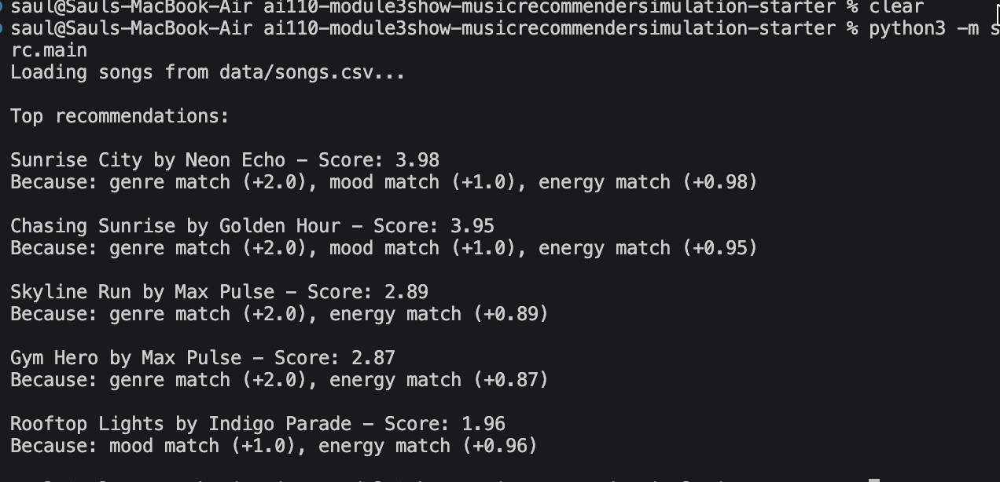

# 🎵 Music Recommender Simulation

## Project Summary

In this project you will build and explain a small music recommender system.

Your goal is to:

- Represent songs and a user "taste profile" as data
- Design a scoring rule that turns that data into recommendations
- Evaluate what your system gets right and wrong
- Reflect on how this mirrors real world AI recommenders

This project is a CLI based python application that simulates a music recommendation engine. It takes a user's taste profile and calculates the mathematical proximity to songs in a dataset to rank and recommend matches.

---

## How The System Works

Explain your design in plain language.

Some prompts to answer:

- What features does each `Song` use in your system
  - For example: genre, mood, energy, tempo
- What information does your `UserProfile` store
- How does your `Recommender` compute a score for each song
- How do you choose which songs to recommend

You can include a simple diagram or bullet list if helpful.

1) Each song will be treated as categorical or numical based on its values like a scale from 0.0-1.0 or  'pop', 'rock'

2) The profile stores the users preferences based on the songs attributes they tend to like. A favorite genre, favorite mood, and target energy.

3) The recommender will calculate a numerical score for a single song based ont the users preferences. For Categorical properties, it will give +2.0 points for a matching genre, and +1.0 point for a matching mood. For Numberical properties it will calculate the difference between the songs energy and the users target energy. If there is a smaller gap more points will be rewarded.

4) It will score every song in the catalog, then it will order them be descending order. The top results will be selected and presented.

```mermaid
graph TD
    A[User Profile] --> C{Scoring Loop: Evaluate Every Song}
    B[songs.csv Catalog] --> C
    
    C --> D{Check Genre}
    D -->|Match| D1[+2.0 Points]
    D -->|No Match| D2[+0 Points]
    
    C --> E{Check Mood}
    E -->|Match| E1[+1.0 Point]
    E -->|No Match| E2[+0 Points]
    
    C --> F{Calculate Energy Gap}
    F --> F1[+ 1.0 - abs(song_energy - target_energy)]
    
    D1 --> G
    D2 --> G
    E1 --> G
    E2 --> G
    F1 --> G
    
    G[Sum Total Score for Song] --> H[Ranking Rule: Sort All Songs Descending]
    H --> I[Output: Top 5 Recommendations]
```



The Final algorithm recipe
The system calculates a score for each track using:
Genre match +2.0 points
Mood match +1.0 points
Energy proximity up to +1.0 points

Some of the potential biases:
Genre match: The genre is weighted twice as heavy as mood or energy, The system might ignore a good match because it determines the user prefers a genre
Missing context: The system does not account for more favorite generes and it doesnt adapt to the recent history


---

## Getting Started

### Setup

1. Create a virtual environment (optional but recommended):

   ```bash
   python -m venv .venv
   source .venv/bin/activate      # Mac or Linux
   .venv\Scripts\activate         # Windows

2. Install dependencies

```bash
pip install -r requirements.txt
```

3. Run the app:

```bash
python -m src.main
```

### Running Tests

Run the starter tests with:

```bash
pytest
```

You can add more tests in `tests/test_recommender.py`.

---

## Experiments You Tried

Use this section to document the experiments you ran. For example:

- What happened when you changed the weight on genre from 2.0 to 0.5
- What happened when you added tempo or valence to the score
- How did your system behave for different types of users

I created a profile that asked for ambient music but with a high energy. The orginal system failed and gave them songs with an energy of 0.26, just because they matched the genre

I also changed the scoring logic to make the genre worth only 1 point and energy up to 2 points. This fixed the problem above.

---

## Limitations and Risks

Summarize some limitations of your recommender.

- The system initially suffered from prioitizing categorical tags like genre over an energy match.
- The data set is small and lacks representation for sever major generas like classical or hip hop.
- The profiles do not adapt to the users recent listening history

---

## Reflection

Read and complete `model_card.md`:

[**Model Card**](model_card.md)

Write 1 to 2 paragraphs here about what you learned:

- about how recommenders turn data into predictions
- about where bias or unfairness could show up in systems like this

Building this project has taught me that recommendations are complex mathematical formulas that take many user preferences into consideration. Ai tool have helped me speed up the coding process but I always had to double check its aligned with my vision. I was suprised how adjusting a single vairable would complete change the personality of the user. This can create bias if the weights are unbalanced or the datasets are small.

